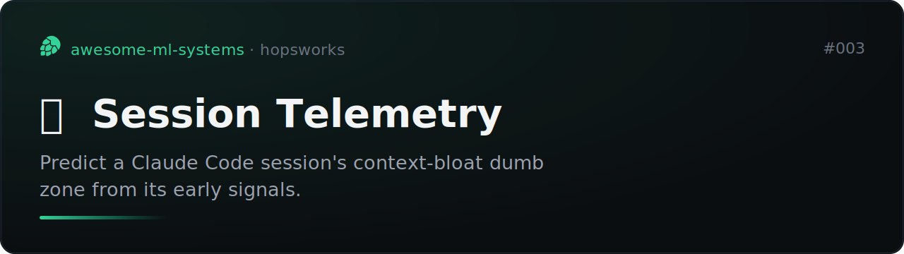

# Session Telemetry (meta ML)

One small ML system per day on Hopsworks.

A slow-burn meta system: log one feature row per Claude Code session, accumulate
over time, then train a model that predicts a session's behaviour from its early
signals.

**Target:** the "dumb zone" classifier. Will a session's live context blow past
300k tokens (the bloat zone where models degrade)? Predicted from early-session
features (first user message, task type, early tool-call rate, project), so it
can warn before the blowup.

Built on [Hopsworks](https://www.hopsworks.ai/), forked from the
[readme-vaporware-score](https://github.com/MagicLex/readme-vaporware-score) base.

## Surviving session and pod restart (the load-bearing design)

The transcripts live at `~/.claude/projects/<proj>/<session>.jsonl`, which is the
pod's **`overlay`** filesystem: ephemeral, wiped on container recreation. So the
gatherer does not depend on it.

- **In-pod Stop hook** (the only irreducibly in-pod piece: no job can read
  another pod's `~/.claude`) copies transcripts to HopsFS
  (`/hopsfs/Users/.../session-telemetry/transcripts/`) after each turn. It runs
  while the pod is alive, so when the pod dies the data is already persisted. The
  hook is registered in the **persistent project settings**
  (`/hopsfs/.../.claude/settings.json` on HopsFS, not the ephemeral
  `~/.claude/settings.json`), so a new pod re-arms it automatically. Re-arm by
  hand with `hooks/install.sh`.
- **Scheduled Hopsworks job** `session-gather` (hourly) is the accumulator. It
  reads the persisted transcripts from HopsFS (via the dataset API, so it needs
  no pod), computes features, and upserts the feature group. Runs on managed
  compute regardless of whether any session is open. `event_time` =
  last-activity, so a session that grows (or crashed mid-way and resumed)
  converges: the latest insert wins on read. Only new-or-grown sessions are
  inserted, so runs are idempotent.
- If a session crashes: everything up to the last completed turn is already in
  HopsFS (synced every turn), and the next job run logs it. At most the one
  in-progress turn is lost.

## Features per session

Token usage (in/out/cache, peak context), message counts, tool-call count and
diversity, web searches, duration, interruptions, skills used, session title,
git branch. Label: peak live context > 300k.

## Status

- [x] Feature extractor (`gather/extract.py`) validated against transcripts
- [x] Gather script (`gather/gather.py`): sync to HopsFS + idempotent FG upsert
- [x] Feature group `session_telemetry` created + existing sessions backfilled
- [x] In-pod Stop sync hook armed in persistent project settings (`hooks/`)
- [x] Scheduled `session-gather` job (hourly) = the reliable accumulator
- [ ] Meta model (trains once enough sessions accumulate, ~a week)
